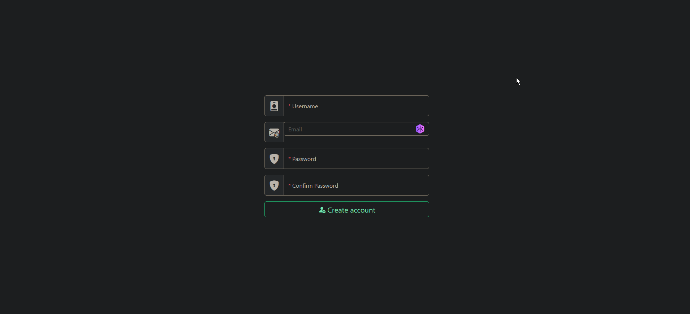

# AndigenaUI

You are free to fork and modify the UI to your liking after you build it for production you can use it in Andigena.\
**This UI can be rendered on any web server not just JavaScript/TypeScript based servers**

## How to use in production

**1.** Build for production with your changes and place contents from `/build` into `/public` in `gateserver`'s root directory.\
**2.** Clone the repository and place `/public` directory in `gateserver`'s root directory.
#### **Option 2 is recommended if you are not experianced with compiling and just want to use this UI.**

## Preview

Register page

ForgetPassword page

## Packages
- [ReactJS](https://reactjs.org)
- [JQuery](https://jquery.com/)
- [ReactToastify](https://www.npmjs.com/package/react-toastify)
- [Bootstrap & BootstrapIcons](https://getbootstrap.com)
- [ReactTSParticles & TSParticles](https://www.npmjs.com/package/react-tsparticles) **OPTIONAL (lags ingame browser af)**

## Integrate in your server
1. `git clone https://github.com/AndigenaTeam/AndigenaUI.git`
2. Move `/public` into your project directory (root or wherever) or build yourself
3. Make 2 **POST** endpoints `/Api/regist_by_email` and `/Api/forget_by_email` (check [AndigenaGate](https://github.com/AndigenaTeam/andigenagate/blob/main/routes/registerRoutes.js)'s implementation for references)

## Contributing
If you wish to contribute feel free to fork this repository and make a Pull Request.

## Available Scripts

### `npm start`

Runs the app in the development mode.\
Open [http://localhost:3000](http://localhost:3000) to view it in your browser.

The page will reload when you make changes.\
You may also see any lint errors in the console.

### `npm run build`

Builds the app for production to the `build` folder.\
It correctly bundles React in production mode and optimizes the build for the best performance.
